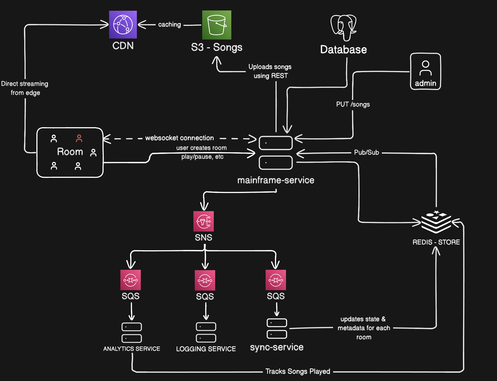

# syncbeat-mainframe

The only client-facing service in SyncBeat. A Spring Boot app that handles
REST (auth, rooms, tracks, playlists, users), holds the live WebSocket/STOMP
connections for rooms, and publishes playback commands onto SNS for the
downstream consumers (`syncbeat-sync`, `syncbeat-analytics`, and the
not-yet-built history/logging consumer) to fan out to.

## System architecture



`mainframe-service` (the two boxes in the middle of the diagram — it runs as
more than one instance behind whatever's routing traffic) sits at the center
of the system:

- **Clients** talk to it two ways: REST for one-shot actions (create a room,
  fetch tracks, upload a song) and a STOMP-over-WebSocket connection per room
  for anything live (play/pause/seek/skip, membership changes).
- **Postgres** is the durable store — users, tracks, rooms, playlists. Admins
  hit `PUT /songs` (i.e. the track endpoints) to register new tracks and get
  a presigned S3 upload URL back.
- **S3 + CloudFront**: audio files live in a private S3 bucket. The mainframe
  never proxies audio bytes — it hands the client a short-lived CloudFront
  *signed URL*, and playback streams directly from the CDN edge afterwards
  (the "Direct streaming from edge" arrow back to Room). CloudFront caches
  from S3 on first request.
- **Redis** is doing two unrelated jobs on the same instance: it's the
  key/value store for live room state (`room:{id}:state`, `room:{id}:members`)
  that this service and `syncbeat-sync` both read/write, and it's the Pub/Sub
  bus that carries state updates back out to whichever mainframe instance
  owns a given client's WebSocket connection.
- **SNS → SQS fan-out**: every playback command a host issues gets published
  once to `room-events-topic.fifo` (`PlaybackEventPublisher`). SNS fans that
  single publish out to three FIFO queues so each consumer processes the same
  event stream independently, at its own pace, without coupling to the others:
  - `sync-queue.fifo` → `syncbeat-sync` recomputes canonical room state and
    writes it back to Redis, which is what actually gets broadcast to
    clients (see the "updates state & metadata for each room" arrow feeding
    back into Redis).
  - `analytics-queue.fifo` → `syncbeat-analytics` increments trending
    counters and periodically flushes `play_count` back to Postgres.
  - `activity-log-queue.fifo` ("LOGGING SERVICE" in the diagram) is created
    by LocalStack init alongside the other two but has no consumer service
    in this repo yet — it's reserved for a future durable play-history
    consumer (see `syncbeat-service-breakdown.md` "History Service").

The mainframe itself never talks to SQS directly — only SNS (publish) and
Redis (read/write + subscribe). It's a **pure fan-out producer** for
everything downstream of the room-events topic.

## WebSocket / STOMP protocol

- Handshake: `GET /ws`, authenticated via the `access_token` httpOnly cookie
  (`JWTHandshakeInterceptor` + `UserHandshakeHandler`) — no `Authorization`
  header needed on the STOMP frames themselves.
- Client subscribes: `SUBSCRIBE /topic/room/{roomId}`. The first local
  subscriber for a room causes this instance to start listening on the Redis
  Pub/Sub channel `room:{roomId}` (`RoomChannelSubscriptionManager`); the
  last one leaving unsubscribes it (`RoomSubscriptionEventListener`).
- Client sends commands: `SEND /app/room/{roomId}/action` →
  `PlaybackController`. Only the room's host may issue playback actions
  (checked server-side against Redis room state, not just hidden client-side)
  and actions are rate-limited per user (`PlaybackRateLimiter`).
- Broadcast: `RoomBroadcastListener` relays anything published on
  `room:{roomId}` in Redis out to the room's local STOMP subscribers via
  `SimpMessagingTemplate`.

## REST API surface

| Area | Endpoints |
|---|---|
| Auth | `POST /api/auth/login`, `/refresh`, `/logout` |
| Users | `POST /api/users/create`, `GET /api/users/all`, `/{id}`, `/me`, `PUT /update`, `DELETE /delete` |
| Rooms | `POST /api/rooms/create`, `GET /{id}`, `PUT /update/{id}`, `DELETE /delete/{id}`, `GET /user/{uid}/all`, `/my-rooms`, `/public`, `POST /{id}/join`, `/{id}/leave` |
| Tracks | `POST /api/v1/tracks` (admin), `GET /api/v1/tracks`, `/trending`, `/{id}`, `GET /{id}/presigned-url` (admin upload URL), `PATCH /{id}/s3-key` (admin), `GET /{id}/stream-url` (CloudFront signed URL), `DELETE /{id}` (admin) |
| Playlists | `POST /api/v1/playlists`, `GET /api/v1/playlists`, `/{id}`, `POST /{id}/tracks`, `DELETE /{playlistId}/tracks/{trackId}`, `PUT /{id}`, `DELETE /{id}` |

`GET /api/v1/tracks/trending` reads `play_count` straight from Postgres, so
it's only as fresh as `syncbeat-analytics`'s last flush — not live.

## Tech stack

Spring Boot 4.1 (Web, WebSocket, Data JPA, Data Redis, Security, Validation),
Flyway (Postgres migrations), AWS SDK v2 (S3, SNS, CloudFront signed URLs),
Lombok, Java 17, Maven.

## Running locally

```bash
cd syncbeat-mainframe
docker compose up -d          # Postgres is expected separately; this brings up LocalStack + Redis
cp .env.example .env          # fill in JWT_SECRET, LOCALSTACK_AUTH_TOKEN, etc.
./mvnw spring-boot:run
```

`localstack/init.sh` runs automatically on container start and creates the
S3 bucket, `room-events-topic.fifo`, all three FIFO queues + their DLQs
(`maxReceiveCount: 5` redrive policy), and the SNS→SQS subscriptions — the
whole event backbone exists before the app itself boots.

With `SPRING_PROFILES_ACTIVE` unset, the app defaults to the `local` profile
(`application-local.properties`), which points the AWS SDK at LocalStack
(`http://localhost:4566`) with dummy credentials instead of real AWS.

## Tests

```bash
./mvnw test
```
